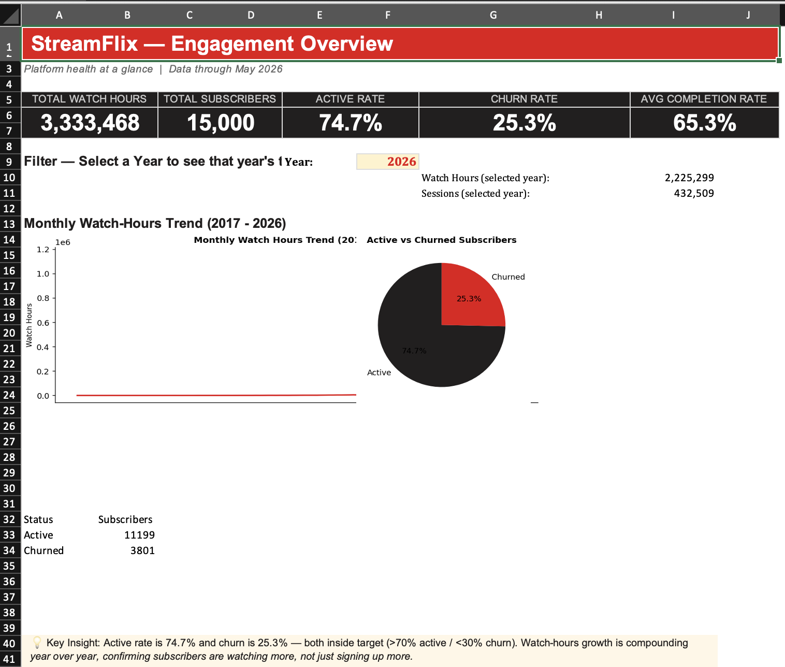
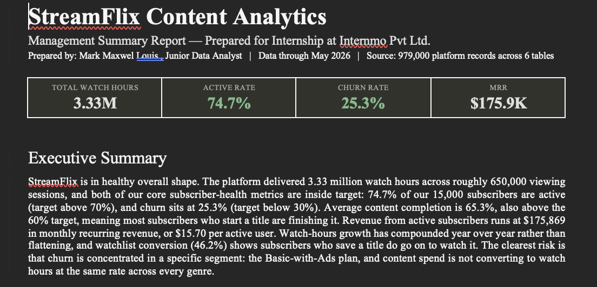
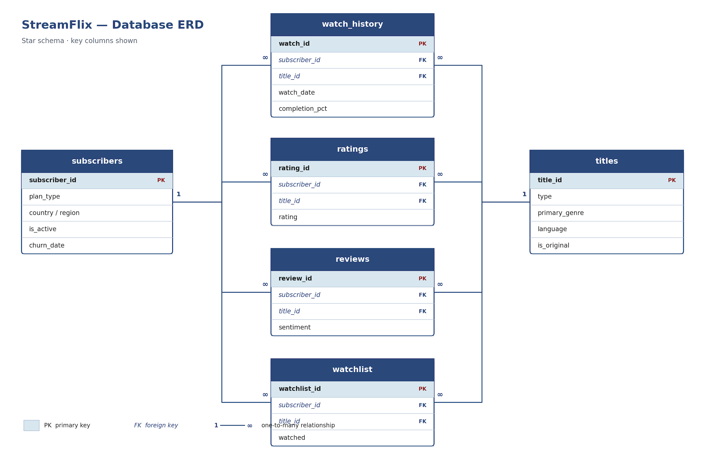

# 🎬 StreamFlix Content Analytics
End-to-End Data Analytics Project | Python | SQL | Excel Dashboard

## 📖 Project Overview
This project simulates the work of a Junior Data Analyst supporting the leadership team of StreamFlix, a fictional subscription-based video streaming platform.
Using approximately 979,000 platform records across six interconnected datasets, the objective was to transform raw operational data into business insights that support strategic decision-making.
The project follows a complete analytics workflow beginning with data quality assessment, progressing through exploratory analysis and KPI development, validating findings using SQL, and concluding with an executive dashboard and management report. The business brief focuses on subscriber behaviour, watch engagement, content performance, churn, revenue and content investment efficiency.

## 📊 Dashboard Preview

## 📑 Executive Summary

## 🏗 Database Schema

## 🎯 Business Problem
1. The management team wanted answers to questions such as:
2. Which content genres generate the highest watch hours?
3. Which subscriber plans have the highest churn?
4. How engaged are subscribers over time?
5. Which content investments generate the greatest return?
6. How efficiently is the catalogue performing?
7. Which subscriber segments should be prioritised for retention campaigns?

## 🗂 Dataset
The project uses six relational datasets.
| Table         | Records |
| ------------- | ------: |
| Subscribers   |  15,000 |
| Titles        |   9,000 |
| Watch History | 650,000 |
| Ratings       | 130,000 |
| Reviews       | 110,000 |
| Watchlist     |  65,000 |

Total records analysed:
979,000+

## 🏛️ Database Design
The project follows a star-schema inspired relational model.
1. Fact Table: Watch History
2. Dimension Tables: Subscribers | Titles
3. Supporting Tables: Ratings | Reviews | Watchlist

## 🔄 Project Workflow
## 🧹 Phase 1 – Data Cleaning
Activities completed
✔ Loaded all datasets
✔ Converted data types
✔ Checked missing values
✔ Duplicate validation
✔ Referential integrity checks
✔ Churn validation
✔ Completion percentage validation
✔ Sentiment validation
Outcome
A fully validated dataset ready for business analysis.

## 📊 Phase 2 – Exploratory Data Analysis
Created ten business-focused visualisations including:
1. Monthly Viewing Sessions
2. Monthly Watch Hours
3. Genre Performance
4. Movies vs TV Shows
5. Country Analysis
6. Device Usage
7. Subscriber Plans
8. Completion Rates
9. Review Sentiment
10.Age Distribution
Each visual includes business observations explaining the trend.

## 📌 Phase 3 – KPI Analysis
Calculated business KPIs including:
- Total Watch Hours
- Active Subscriber Rate
- Churn Rate
- Monthly Recurring Revenue
- Average Revenue Per User
- Completion Rate
- Watchlist Conversion
- Hit Concentration
- Originals Share
- Watch Hours per Subscriber
- Additional business analysis
- Subscriber Segmentation
- Churn Analysis
- Content Spend Efficiency
- Cohort Retention

## 🗄 Phase 4 - SQL Analysis
Built analytical SQL queries covering:
* Genre Performance
* Device Usage
* Country Performance
* Revenue
* Subscriber Engagement
* Watchlist Conversion
* Completion Rate
* Content Investment Efficiency
The SQL outputs were validated against the Python KPI calculations to ensure consistency.

## 📊 Phase 5 – Interactive Dashboard Development
The final dashboard was developed in Microsoft Excel and includes: 
1. Executive KPI Cards
2. Watch Hour Trends
3. Active vs Churn Analysis
4. Interactive Year Filter
5. Subscriber Metrics
6. Business Insights

## 📑 Executive Report
A business report was prepared summarising:
- Executive Summary
- Business Findings
- Risks
- Opportunities
- Strategic Recommendations

## 🛠 Tools Used
| Tool            | Purpose               |
| --------------- | --------------------- |
| Python          | Data Cleaning         |
| Pandas          | Data Processing       |
| Matplotlib      | Data Visualisation    |
| SQLite          | SQL Analytics         |
| SQL             | Business Queries      |
| Microsoft Excel | Interactive Dashboard |
| GitHub          | Version Control       |

## 📈 Key Insights
* Watch hours increased consistently over multiple years.
* Premium subscribers generated the highest engagement.
* Basic-with-Ads subscribers experienced the highest churn.
* Drama, Comedy and Action generated the greatest watch hours.
* StreamFlix Originals contributed a significant share of platform engagement.
* Content investment efficiency varied considerably across genres.
* Watchlist conversion exceeded the target benchmark.
These findings informed recommendations around subscriber retention, content investment, and catalogue strategy, as reflected in the management report.

## 📂 Repository Structure
README.md
images/
dashboard/
notebooks/
sql/
report/
docs/

Files Included
| File                             | Description                            |
| -------------------------------- | -------------------------------------- |
| Phase1_DataCleaning.pdf          | Data validation and quality assessment |
| Phase2_EDA.pdf                   | Exploratory data analysis              |
| Phase3_KPIs.pdf                  | KPI calculations                       |
| Phase3_SQL_Queries.sql           | Analytical SQL queries                 |
| Phase3_SQL_Analysis.pdf          | SQL execution and validation           |
| StreamFlix_Dashboard.xlsx        | Interactive dashboard                  |
| StreamFlix_Management_Report.pdf | Executive business report              |
| Project_Requirements.pdf         | Original project brief                 |

## 💼 Business Value
Rather than focusing solely on visualisations, this project demonstrates how analytics can support business decision-making through:
1. Data Quality Assessment
2. Exploratory Analysis
3. KPI Development
4. SQL Reporting
5. Executive Dashboard Design
6. Business Recommendations

## 👤 About Me

Mark Maxwel Louis
Aspiring Data Analyst | Business Intelligence Analyst | Finance Analyst

Skills:
- Python
- SQL
- Excel
- Power BI
- Business Intelligence
 -Data Analysis
- Data Visualisation

LinkedIn
https://www.linkedin.com/in/markmaxwellouis/

GitHub
https://github.com/MarkMaxwel112075

## 📜 License
This repository is intended for educational and portfolio purposes.

